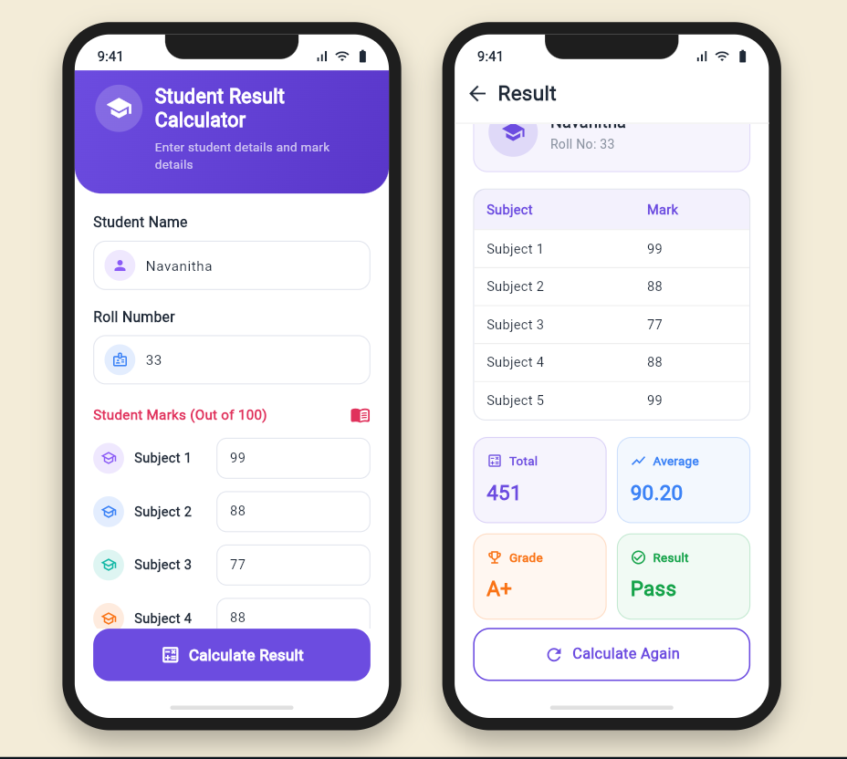

# 📚 Student Result Calculator

A simple and interactive **Student Result Calculator** developed using **Flutter and Dart**. The application allows users to enter student details and subject marks, then automatically calculates the total marks, average, grade and final result.

## 📱 App Preview

<p align="center">
  
</p>

## ✨ Features

* Student name and roll number input
* Subject-wise marks entry
* Automatic total marks calculation
* Average marks calculation
* Grade calculation
* Pass/Fail status
* Calculate Again functionality
* Clean and user-friendly interface
* Responsive mobile-style UI

## 🛠️ Technologies Used

* **Dart**
* **Flutter**
* **DartPad**

## 📊 Result Calculation

The application processes the entered marks and displays:

| Result      | Description                  |
| ----------- | ---------------------------- |
| Total Marks | Sum of all subject marks     |
| Average     | Average of the entered marks |
| Grade       | Grade based on the average   |
| Result      | Pass or Fail status          |

## 🚀 Getting Started

### Run with DartPad

1. Open [DartPad](https://dartpad.dev/)
2. Select **Flutter**
3. Copy the code from `main.dart`
4. Paste the code into DartPad
5. Click **Run**

### Run Locally

Clone the repository:

```bash
git clone https://github.com/YOUR_USERNAME/student-result-calculator.git
```

Navigate to the project:

```bash
cd student-result-calculator
```

Install dependencies:

```bash
flutter pub get
```

Run the application:

```bash
flutter run
```

## 📂 Project Structure

```text
student-result-calculator/
│
├── main.dart
├── student_result_calculator.png
└── README.md
```

## 🎯 Project Objective

This project was developed to practice **Flutter UI development, Dart programming, user input handling and basic calculation logic** while creating a practical student result management interface.

## 🔮 Future Enhancements

* Multiple student result management
* Result history
* Custom subject names
* PDF result generation
* Local database integration
* Dark mode
* Improved validation and error handling

## 👩‍💻 Author

**Navanitha V**

AI & Data Science Undergraduate

---

⭐ **If you find this project useful, consider giving the repository a star!**
